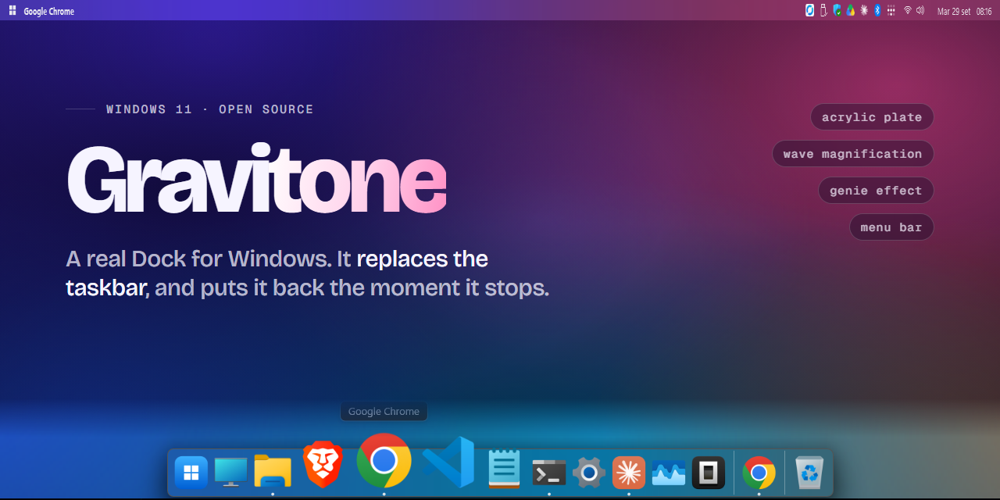
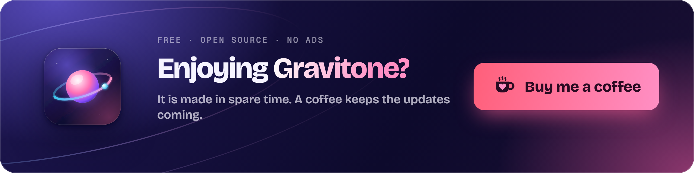
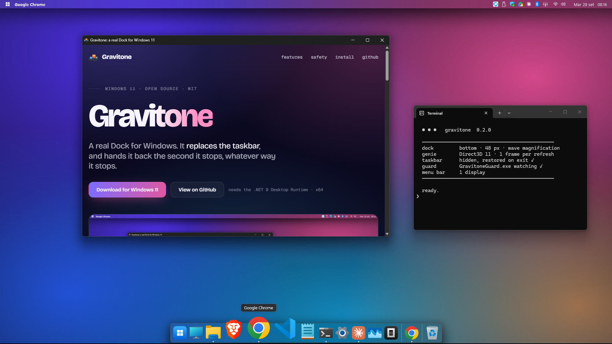
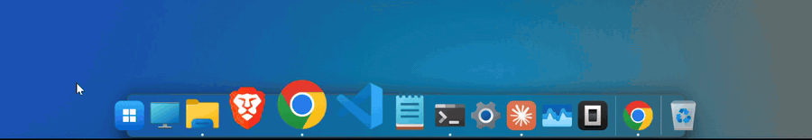
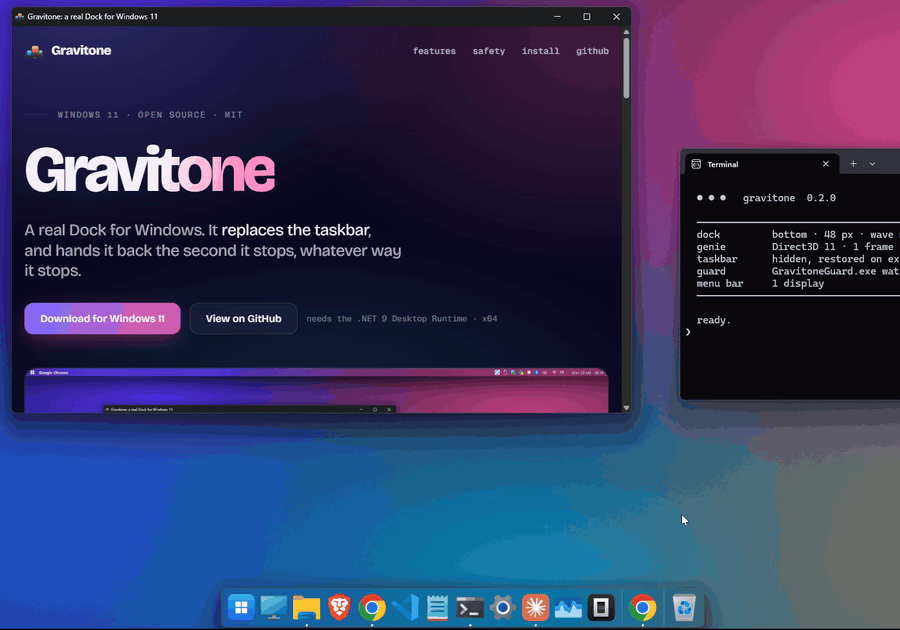
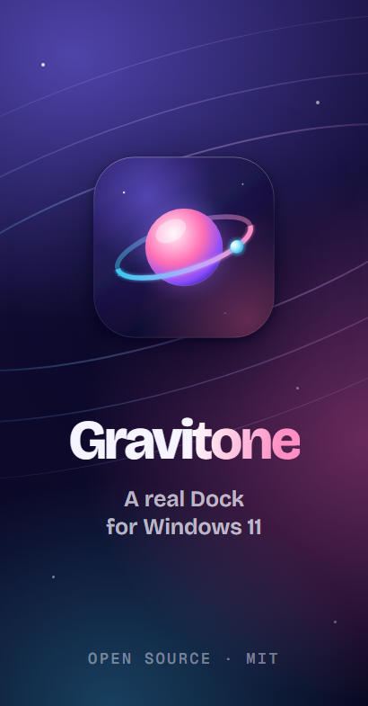

<div align="center">



<br><br>

[](https://github.com/lupanostefano/Gravitone/releases/latest)
&nbsp;
[](https://lupanostefano.github.io/Gravitone/)
&nbsp;
[](https://ko-fi.com/hikari22)

[](https://github.com/lupanostefano/Gravitone/actions/workflows/ci.yml)
[](https://github.com/lupanostefano/Gravitone/actions/workflows/codeql.yml)


**A real Dock for Windows.**<br>
It replaces the taskbar, magnifies like a Mac's, flows windows into their icons like a genie,<br>
and hands the taskbar back the second it stops, whatever way it stops.

<br>

<a href="https://ko-fi.com/hikari22"></a>

</div>

<br>

<p align="center">
  
</p>

## Why it exists

Windows docks usually come in two flavours: an app-launcher strip floating over the taskbar, or a skin that fakes the look with a flat translucent window. Gravitone is neither. It is an **app bar** that takes the taskbar's place in the shell: maximized windows stop above it, the Windows taskbar is switched off while it runs, and the tray icons move to a **menu bar** across the top of the screen.

It is also built to be **hard to get stuck with**. Replacing the taskbar means that if the replacement dies, you have no taskbar. Gravitone treats that as the main problem to solve, not a footnote (see [Safe by construction](#safe-by-construction)).

## What you get

<table>
<tr>
<td width="50%" valign="top">

### Real Windows 11 acrylic
The plate is a separate, non-layered window with the **DWM system backdrop** and antialiased rounded corners: the same acrylic the shell uses, not a tinted rectangle. It follows light and dark mode and re-applies itself after sleep and lock.

</td>
<td width="50%" valign="top">

### Wave magnification
Icons grow under the pointer in a smooth wave, anchored so the icon you are aiming at stays where it is. Labels, running dots, a bounce on launch and a bounce when an app asks for attention.

</td>
</tr>
<tr>
<td valign="top">

### Genie effect, on the GPU
Minimize and restore from the Dock flow the real window through a funnel into its icon. Drawn with Direct3D 11 and DirectComposition, one frame per screen refresh (measured at **280 fps on a 280 Hz monitor**, tens of milliseconds of CPU per animation).

</td>
<td valign="top">

### A menu bar
Active app name, Start on the logo, your **tray icons** (clicks, double-clicks and menus reach the apps as they would from the taskbar), Wi-Fi with signal strength, volume, battery, date and time. One bar per monitor.

</td>
</tr>
<tr>
<td valign="top">

### Edit it with your hands
Drag to reorder. Drag an icon out and it disappears in a puff of smoke. Drop any program, shortcut, folder or **This PC / Control Panel** on it to pin it. Folders become **stacks**. The Recycle Bin is a real one.

</td>
<td valign="top">

### Multi-monitor and DPI
Put the Dock on any screen, or push the pointer against the bottom edge of another one and it follows, as on a Mac. Sizes are computed per monitor scale. Sleep, lock, user switch and monitor changes are handled.

</td>
</tr>
</table>

<p align="center">
  
</p>

<p align="center">
  
</p>

## Safe by construction

The taskbar comes back. Every time.

| What happens | What Gravitone does |
| --- | --- |
| You quit it | Restores the taskbar exactly as you had it (auto-hide state included). |
| It crashes | `GravitoneGuard.exe`, a separate process it keeps alive, sees it die and restores the taskbar. |
| You kill it from Task Manager, or kill the whole process tree | The guard is deliberately **not** a child process, so it survives and restores. |
| You shut down or sign out | The taskbar is given back *while Explorer still exists* (`WM_QUERYENDSESSION`), and hidden again if the shutdown is cancelled. |
| Power cut or forced restart while hidden | A `RunOnce` entry restores it at the next sign-in unless a running Gravitone is keeping it hidden. |
| Explorer restarts | Gravitone notices the new Explorer, hides the new taskbar and registers again. |
| You just want it back for a minute | **Ctrl + Alt + Shift + B** toggles the Windows taskbar. |
| Something is really wrong | `Gravitone.exe --restore-taskbar` (the emergency switch, works without the dock running). |

## Install



**Setup (recommended).** Download `Gravitone-<version>-setup.exe` from [Releases](https://github.com/lupanostefano/Gravitone/releases/latest) and run it.

- Installs for your account only: no administrator rights needed.
- Checks for the .NET 9 Desktop Runtime and, if it is missing, downloads it from Microsoft for you.
- Lets you choose "start with Windows" and a desktop shortcut, in English or Italian.
- Adds a *Restore the Windows taskbar* shortcut to the Start menu, just in case.
- **Updating:** run the new setup. A running Gravitone is closed (taskbar handed back for the moment), updated and started again.
- **Uninstalling** quits the Dock, gives the taskbar back and removes the start-up entries, before deleting anything. Your settings stay in `%APPDATA%\Gravitone` for a later reinstall.
- Silent install for IT: `Gravitone-<version>-setup.exe /VERYSILENT /CURRENTUSER /TASKS="autostart"`.

**Portable.** `Gravitone-<version>-win-x64-portable.zip`: unzip anywhere, install the [.NET 9 Desktop Runtime](https://dotnet.microsoft.com/download/dotnet/9.0) if needed, run `Gravitone.exe`. To remove it: `Gravitone.exe --uninstall`, then delete the folder.

Right-click an empty spot of the Dock for **Settings**, "Start with Windows" and the taskbar switch.

> **Heads up:** the binaries are not code-signed yet, so SmartScreen may warn on first run. Every release lists SHA-256 sums and carries [build provenance](https://github.com/lupanostefano/Gravitone/attestations) from GitHub Actions (`gh attestation verify <file> -R lupanostefano/Gravitone`), so you can check the file was built from this repository.

Requires Windows 11 x64 (developed and tested on build 26200).

## Using it

| | |
| --- | --- |
| Click an icon | Launch. If running: bring forward, or minimize if already in front (several windows: next one). |
| Shift + click, middle click | New window / new instance. |
| Right-click an icon | Recent files, windows, *Keep in Dock*, *Open at login*, *Show in Explorer*, *Quit*. |
| Right-click an empty spot | Settings, taskbar switch, menu bar, start with Windows. |
| Drag an icon along the Dock | Reorder. Drag it away: remove. |
| Drop a file or folder on the Dock | Pin it (a folder becomes a stack). |
| Win + 1 … 9 | The n-th app of the Dock, like the taskbar. |
| Click the Start icon / the menu bar logo | Start menu. Right-click: the Win + X menu. |

## Configuration

Everything is in the Settings window and saved at once to `%APPDATA%\Gravitone\config.json`. Logs: `%APPDATA%\Gravitone\log.txt` (add `--diag` for more).

| Setting | Default | |
| --- | --- | --- |
| `IconSize` / `MagnifiedSize` / `Magnification` | 48 / 80 / on | Sizes in device-independent pixels. |
| `Edge` | `Bottom` | `Bottom`, `Left` or `Right`. |
| `AutoHide` | off | Slides away until the pointer touches the edge. |
| `Display` | primary | Which monitor holds the Dock (`\\.\DISPLAY2`). |
| `FollowPointer` | on | The Dock follows the pointer to another monitor's edge. |
| `Genie` | on | The genie effect. |
| `ReplaceTaskbar` | on | Hide the Windows taskbar while Gravitone runs. |
| `MenuBar` / `MenuBarOnAllDisplays` | on / on | The menu bar. |
| `NumberShortcuts` | on | Win + 1 … 9. |
| `StartWithWindows` | on | Starts at sign-in without the usual delay, through a scheduled task. |

## Build from source

```bash
git clone https://github.com/lupanostefano/Gravitone.git
cd Gravitone
dotnet test Gravitone.slnx     # .NET 9 SDK: builds the app and runs the unit tests
bin\Debug\net9.0-windows\Gravitone.exe
```

`Gravitone.exe --selftest` checks the parts that need no window (displays, language, layout, shell icons). The installer is `installer/Gravitone.iss` ([Inno Setup 6](https://jrsoftware.org/isinfo.php)); the icon and the installer art are drawn from `art/` by `tools/make-icon.ps1` and `tools/make-installer-art.ps1`.

**Every change goes through CI** ([`.github/workflows`](.github/workflows)): Debug and Release builds with warnings as errors, a formatting check, the unit tests, the self-test of the built app, the installer build, CodeQL, and a check that no commit credits an AI assistant as author. The installer is also exercised like a user would: silent install, self-test of the installed copy, uninstall, and a check that nothing is left behind (`tools/test-install.ps1`). A tag `vX.Y.Z` runs all of it again and publishes the release with the installer, the portable zip, checksums and provenance. See [CONTRIBUTING.md](CONTRIBUTING.md).

The interesting parts of the code:

- `Interop/AppBar.cs`, `Core/TaskbarState.cs`, `Core/TaskbarReplacer.cs`, `Core/Guard.cs`: registering as an app bar, hiding and restoring the taskbar, the guard process.
- `UI/DockWindow.cs`, `Core/DockLayout.cs`: input, animation, the magnification wave.
- `UI/BackdropWindow.cs`, `UI/AcrylicWindow.cs`: the DWM acrylic plate.
- `Core/Genie.cs`: the genie (Direct3D 11 + DirectComposition through [Vortice.Windows](https://github.com/amerkoleci/Vortice.Windows)).
- `UI/MenuBars.cs`, `UI/TrayIconsPanel.cs`: menu bars; the tray comes from [ManagedShell](https://github.com/cairoshell/ManagedShell).

More detail (in Italian, for now): [docs/technical-notes.it.md](docs/technical-notes.it.md).

## Limits, honestly

- The interface is available in English and Italian (it follows the language of Windows, or pick one in Settings). Other languages are welcome as pull requests: the texts live in one file, `Core/Loc.cs`.
- The genie plays for minimize and restore started **from the Dock**. Minimizing with a window's own button still uses Windows' animation.
- Taskbar features that live inside Explorer's own window have no public API and are not reproduced: progress bars and badges on icons, custom jump-list tasks (recent files are shown).
- Quick Settings (Win + A) and Notifications (Win + N) always open at the bottom right, where Windows thinks the taskbar is.
- Built and tested on one Windows 11 PC. Multi-monitor and non-100% scaling are implemented but have had far less testing than the rest: [open an issue](https://github.com/lupanostefano/Gravitone/issues) if something is off.

## Roadmap

- [x] Dock, menu bar, taskbar replacement, guard process, multi-monitor, genie
- [x] English and Italian interface, with a language setting
- [ ] Signed binaries and a Microsoft Store package
- [ ] Genie for minimize from the window's own button

## Support

Gravitone is free, open source and has no ads. If it made your Windows a little nicer, a coffee keeps it going:
[**ko-fi.com/hikari22**](https://ko-fi.com/hikari22) (or the *Sponsor* button at the top of this page).

<a href="https://ko-fi.com/hikari22"></a>

Bug reports and ideas are just as welcome: [open an issue](https://github.com/lupanostefano/Gravitone/issues/new/choose).

## License

[MIT](LICENSE). Third-party components are listed in [THIRD-PARTY-NOTICES.md](THIRD-PARTY-NOTICES.md).

Gravitone is an independent project. It is not affiliated with, endorsed by, or sponsored by Apple Inc. or Microsoft. The icon and every graphic in this repository are original.

